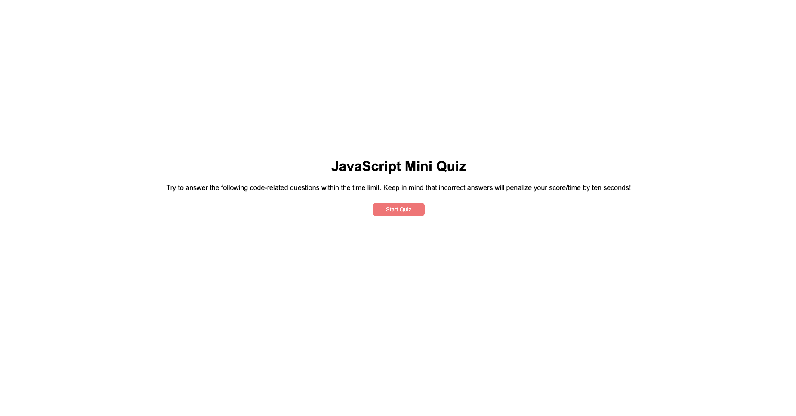
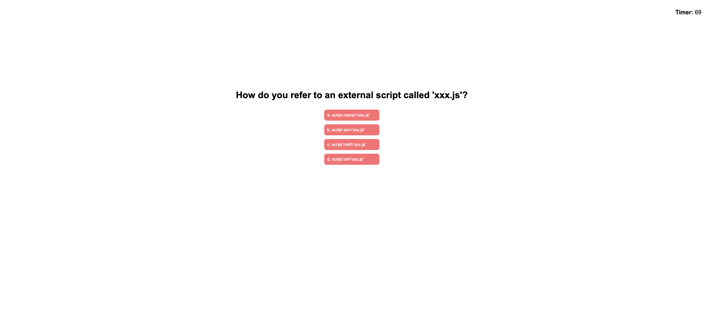
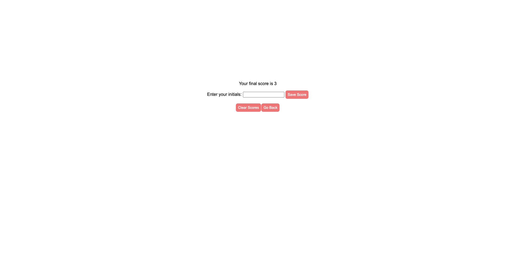

# js-mini-quiz
## Description
The motivation behind this project was to enhance my coding skills by building a fun and interactive Javascript Quiz in a game format. The aim was to make it easy and enjoyable for users to reinforce their understanding of Javascript while competing with others on the same device. By gamifying the studying process, the project addresses the problem of tedious and repetitive studying. Through this project, I have gained valuable experience in making studying fun and interactive. Although there are areas for improvement, I am confident in my ability to continue developing this project in a direction that will benefit both users and the product. The unique aspect of this project is its ability to engage users and encourage them to improve their scores through reinforcing their Javascript knowledge, making it a mutually beneficial experience for all parties.

## Table of Contents
* [Installation](#installation)
* [Usage](#usage)
* [Credits](#credits)
* [License](#license)

## Installation
Review the code on the GitHub repository. The deployed site can be accessed at [GitHub Pages](https://etapm.github.io/password-generator-03/) or by visiting the [GitHub Repository](https://github.com/etapm/password-generator-03).
## Usage
Upon initiating the quiz by pressing the "start quiz" button, the user will be presented with 10 basic Javascript questions, each with 4 options to choose from, within a 75-second time frame. Incorrect answers will result in a penalty of 10 seconds to the user's score. Upon completion of the quiz or expiration of the time limit, the user will be prompted to enter their initials and save their scores, clear the scores, or return to the home page for another round.

##### Step 1: Click the "Start Quiz" button.

##### Step 2: Click on your answer.

##### Step 3: Click "Save Scores", "Clear Scores", or "Go back".

## Credits
N/A

## License
N/A

## Badges
N/A

## Features
N/A

## How to Contribute
N/A

## Tests
N/A
